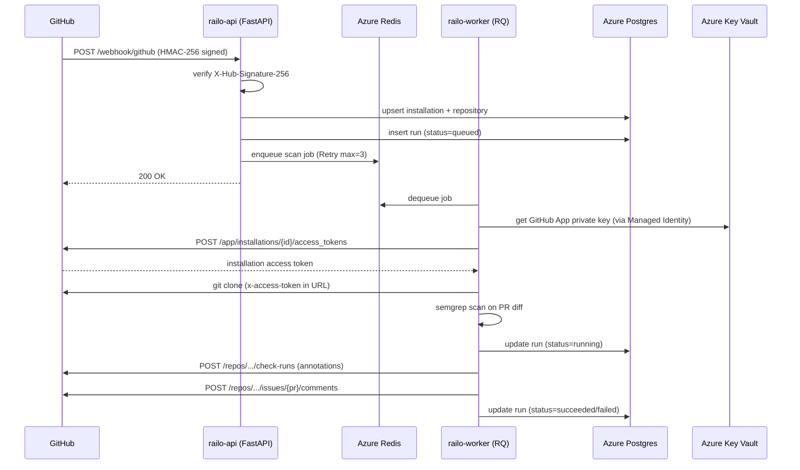

# Railo Cloud — Architecture

## Component Overview

```
┌──────────────────┐         HTTPS POST          ┌─────────────────────────────┐
│                  │  /webhook/github (HMAC-256)  │                             │
│   GitHub.com     │ ────────────────────────────►│  railo-api                  │
│                  │                              │  (FastAPI, Azure Container  │
│  pull_request    │◄────────────────────────────│   App)                      │
│  events          │   check run + PR comment     │                             │
└──────────────────┘                              └────────────────┬────────────┘
                                                                   │
                                                          enqueue job (RQ)
                                                                   │
                                                                   ▼
                                                  ┌─────────────────────────────┐
                                                  │  railo-redis                 │
                                                  │  (Azure Cache for Redis)     │
                                                  │  queue: railo:queue:default  │
                                                  └────────────────┬────────────┘
                                                                   │
                                                           dequeue job
                                                                   │
                                                                   ▼
                                                  ┌─────────────────────────────┐
                                                  │  railo-worker                │
                                                  │  (RQ Worker, Azure Container │
                                                  │   App)                       │
                                                  │                              │
                                                  │  1. get installation token   │
                                                  │  2. git clone PR branch      │
                                                  │  3. semgrep scan on diff     │
                                                  │  4. generate patch plan      │
                                                  │  5. POST check run →GitHub   │
                                                  │  6. POST PR comment →GitHub  │
                                                  └──────────────┬──────────────┘
                                                                 │
                                                       persist run record
                                                                 │
                                                                 ▼
                                                  ┌─────────────────────────────┐
                                                  │  railo-pg                    │
                                                  │  (Azure Postgres Flexible    │
                                                  │   Server)                    │
                                                  │                              │
                                                  │  tables: installations,      │
                                                  │          repositories, runs  │
                                                  └─────────────────────────────┘
```

## Mermaid Diagram



## Infrastructure

```
Azure Resource Group: railo-cloud (East Asia)
│
├── railo-env              Azure Container Apps Environment
│   ├── railo-api          FastAPI webhook receiver + management API
│   └── railo-worker       RQ worker (minReplicas=1, gracePeriod=900s)
│
├── railo-postgres         Azure Postgres Flexible Server
├── railo-redis            Azure Cache for Redis
├── railo-kv               Azure Key Vault
│   ├── pg-conn            PostgreSQL connection string
│   ├── redis-url          Redis connection string
│   ├── github-app-id      GitHub App ID (2914293)
│   ├── github-private-key GitHub App RSA private key
│   └── github-webhook-secret Webhook HMAC secret
│
└── railo-mi               User-assigned Managed Identity
    └── grants Key Vault Secrets User role → railo-kv
```

## Data Flow: PR opened/synchronised

1. Contributor opens or pushes to a PR in an installed repository
2. GitHub delivers `pull_request` event to `https://<railo-api-fqdn>/webhook/github`
3. API verifies HMAC-SHA256 signature; returns 400 on mismatch
4. API creates a `run` record (`status=queued`) and enqueues a `scan_pr` job with 3-attempt retry
5. Worker dequeues the job, obtains a fresh installation access token (valid 1 hour)
6. Worker clones the head branch, then fetches the base ref and computes `origin/{base}..{head}` diff
7. Semgrep evaluates the changed files against rules in `fixpoint-cloud/rules/`
8. Worker posts a GitHub Check Run with per-line annotations, and a PR comment summarising findings
9. Run record is updated to `succeeded` or `failed`; permanently failed jobs go to the DLQ and are logged

## Security Boundaries

| Boundary | Control |
|---|---|
| GitHub → API | HMAC-SHA256 (`X-Hub-Signature-256`) |
| Client → Management endpoints | `X-API-Key` header (`settings.api_key`) |
| Cross-origin requests | CORS whitelist (`settings.allowed_origins`) |
| Rate limiting | 60 webhook req/min per IP (slowapi) |
| Secrets storage | Azure Key Vault + Managed Identity (no env var injection) |
| Container user | Non-root `appuser` (UID 1001) |
| Image provenance | ACR private registry, tags are 12-char git SHAs |
